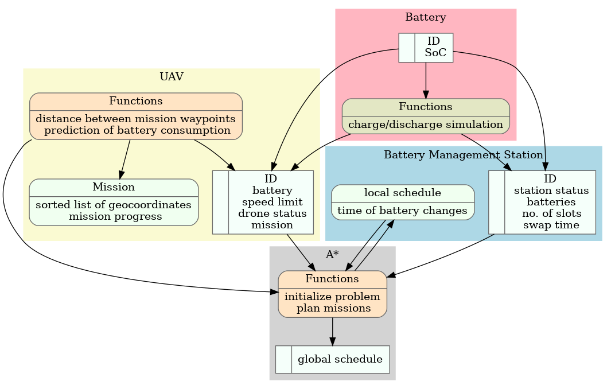
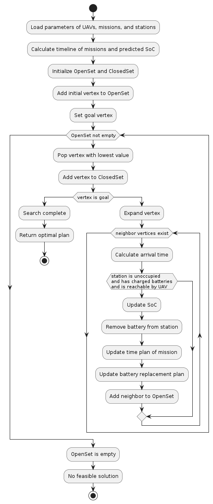
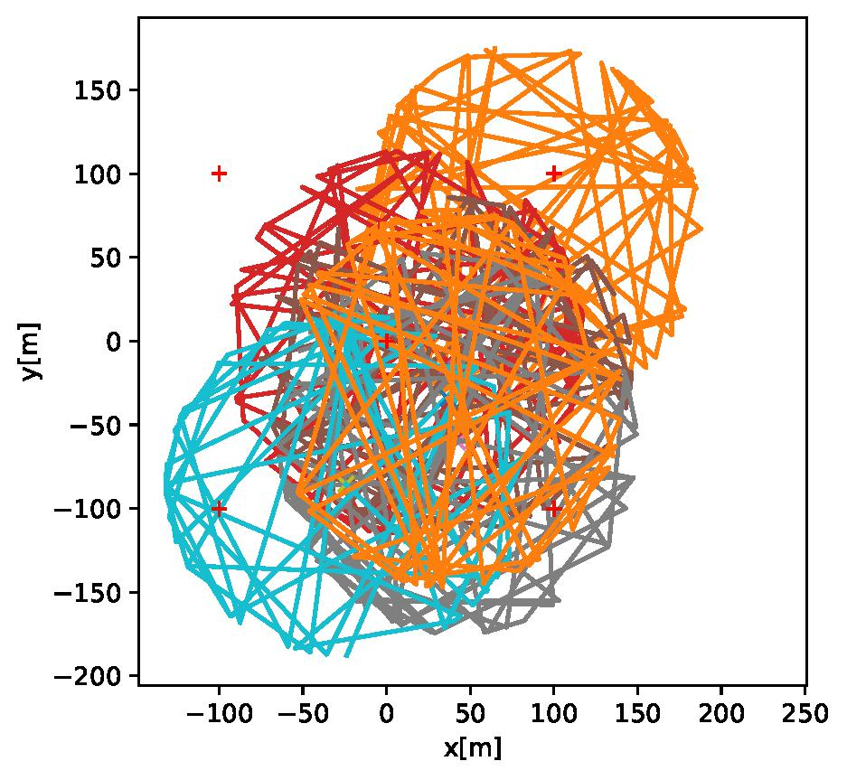
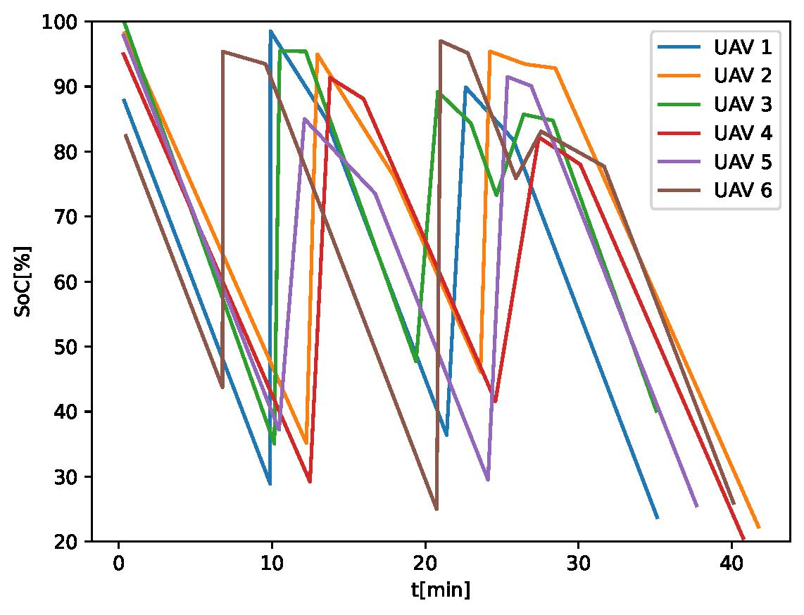
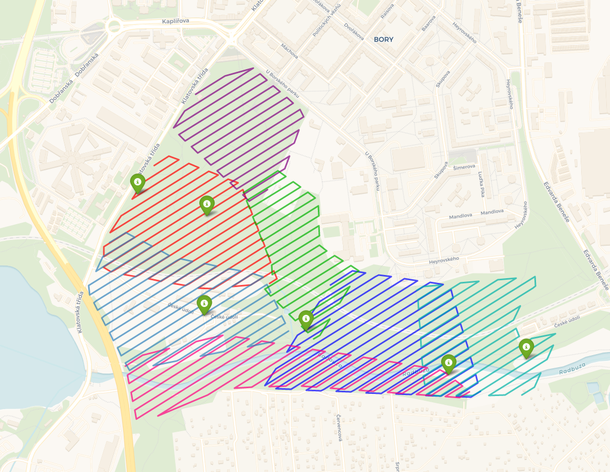

# Mission Planner for UAV Battery Replacement

Mission planner for Unmanned Aerial Vehicle (UAV) battery replacement is the system, whose objective is to plan replacements of the UAV's battery on the static battery management stations. The plan ensures that UAVs have sufficient energy to fulfill their long-term mission, which would otherwise be impossible. 

The appropriate time to withdraw the UAV is sought with a well-known A* algorithm implemented in `astar.py`. While the core A* logic is inspired by the work of Nicholas Swift (https://medium.com/@nicholas.w.swift/easy-a-star-pathfinding-7e6689c7f7b2), the code has been significantly modified to address problem-specific needs.
  


The prediction of discharge rate is acquired based on distances between mission waypoints, the UAV’s velocity, maximum flight time, and initial SoC. The cost of battery replacement is determined by the predicted UAV battery drain during its flight to the platform and back to the mission. The task is further limited by a fixed number of charged batteries in the platforms. The mission planner also performs a calculation of the expected flight time to the platform, based on which a time slot is entered into the schedule with a safe time reserve to avoid UAV collisions near the platform. The process of planning with A* is depicted in the following figure:


## Evaluation of Mission Planner

Two distinct scenarios were employed to test the functionality of the mission planner. In both scenarios, several static battery management stations and multiple UAVs were considered, each with its mission. The missions were designed in such a way that completion was not possible for any UAV without changing its battery in the process. In both scenarios, the minimum SoC, which signifies that the UAV is not permitted to fly with a lower value, was set to 20%.

### Randomly Generated Missions

In the first scenario, the UAV parameters were generated randomly. Their missions were also generated randomly, but to follow the path given by the waypoints on an ellipse. Results for this scenario were acquired by running the script `run_orchestrator.py`. The map with battery stations and generated missions is presented in the following picture.

The output of the mission planner in this realization is presented in [random.out](random.out) and the SoC of each UAV in time is presented in the following figure:


### Area Coverage Multi-UAV Missions in City Park

In the second scenario, the parameters of the UAVs were selected according to the Iris UAV, and the mission was planned in the software for planning UAV missions in the form of an area coverage mission above the city park. This mission can be utilized to address real-world use cases where UAVs are, for example, employed in search and rescue operations. The results for this scenario are presented in jupyter notebook `run_orchestrator_park.ipynb`.

#### UAV Mission Acquisition

The missions were planned in the existing city park using open-source software for flight control and mission planning, namely [QGroundControl](http://qgroundcontrol.com/). Subsequently, the missions were uploaded into the UAV, which was simulated using [PX4 Software In The Loop (PX4 SITL)](https://docs.px4.io/main/en/simulation/index.html), a component of the PX4 Autopilot software. This was followed by a download of the data. A Python implementation of the [MAVSDK](https://mavsdk.mavlink.io/main/en/index.html) library was employed for MAVLink protocol-based communication with UAVs.

The PX4 SITL with custom coordinates with UAV physics simulation in Gazebo was launched using the following command in docker:
```
docker run --rm -it --env PX4_HOME_LAT=49.7218178 --env PX4_HOME_LON=13.3645208 --env PX4_HOME_ALT=350.0 jonasvautherin/px4-gazebo-headless
```
The missions were afterward uploaded by QGroundControl and downloaded using `download_and_save.py`, which also saved missions into folder `missions` using `cloudpickle` library.

Resulting missions together with battery management station locations are depicted in the following map:

